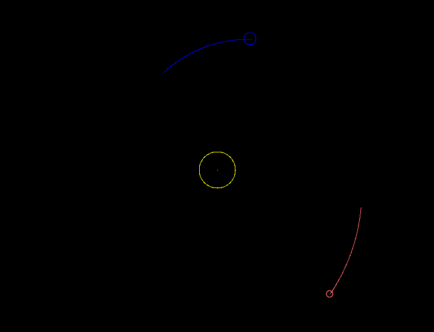

# SolarSystemSim

A simple solar system simulation using SDL3 and ImGui(WIP).
-

-
### Orbit Trails


---
## Structure

- `bin/` - compiled binaries
- `build/` - intermediate build files
- `logs/` - simulation output logs
- `assets/` - shaders, textures, etc.
- `include/` - header files
- `src/` - source code
- `third_party/` - external libraries

## Build

Uses CMake to build.

```bash
mkdir -p build
cd build
cmake ..
make
```
